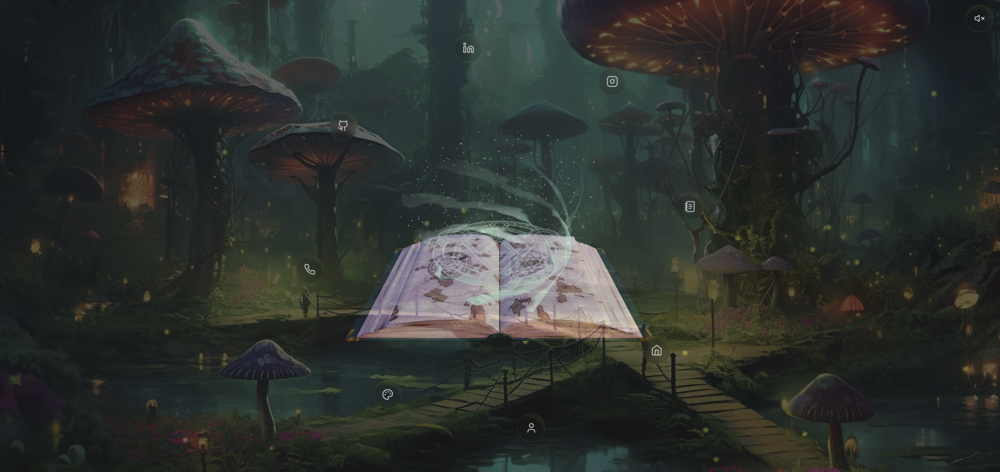
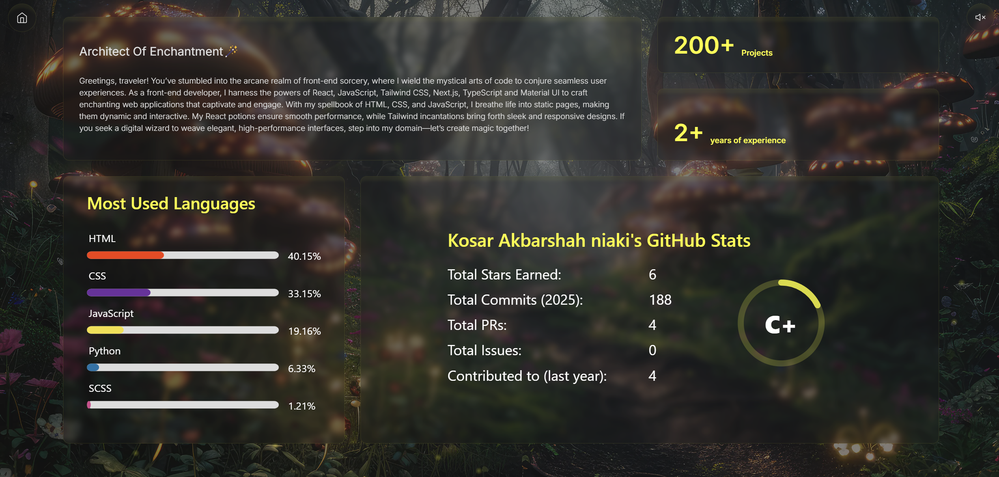
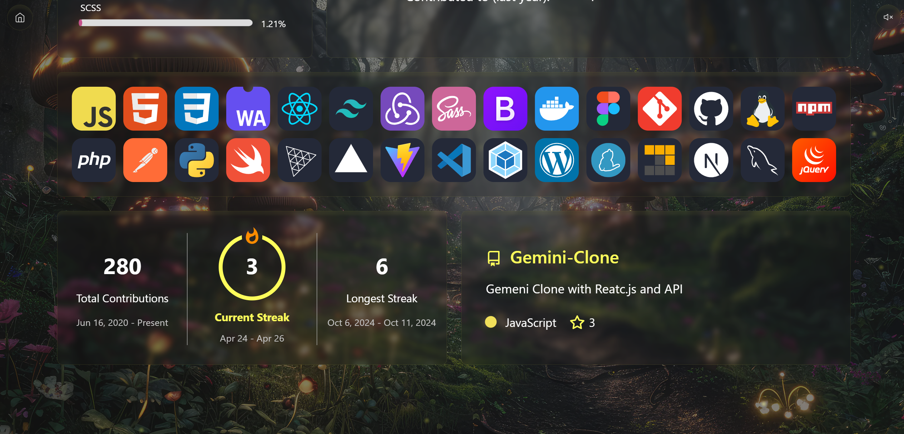
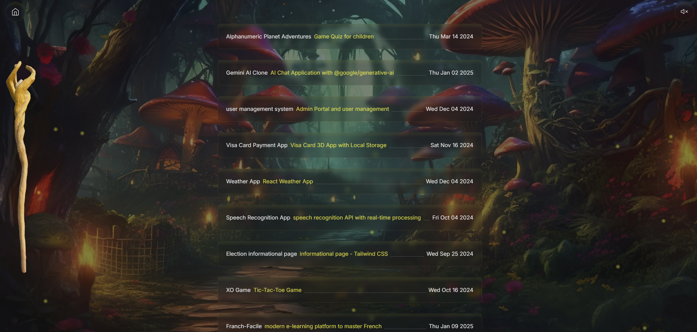
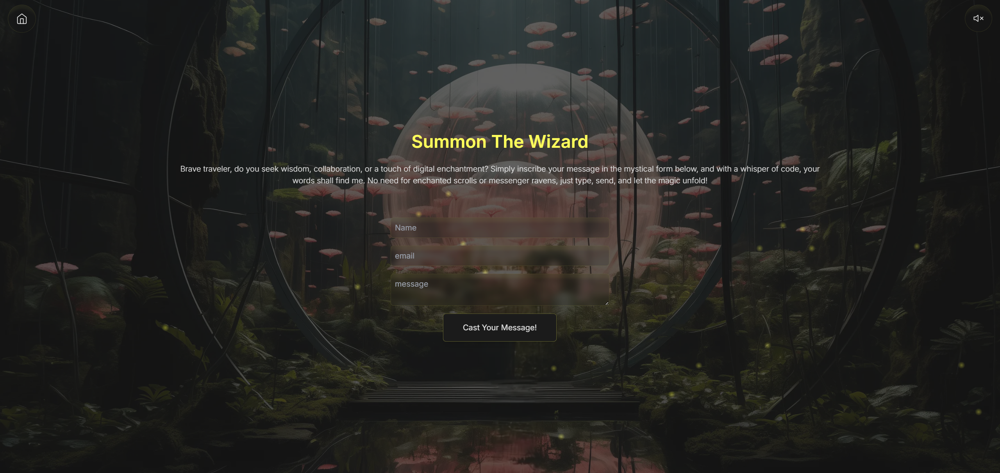

# 🚀 Portfolio - Next.js Creative Portfolio

**Live Demo:** [Live Demo](https://portfolio-clean.vercel.app/)  

---

## ✨ Overview

A **creative personal portfolio** built with **Next.js**, **React Three Fiber**, and **TailwindCSS**.  
It features animated 3D models, smooth transitions, ambient background music, and a clean responsive design.

---

## 🖼️ Screenshots

### 🏠 Home Page


### 🙋 About Section




### 📚 Projects Page


### 📞 Contact Page


---

## 🛠️ Tech Stack

- **Next.js 14**
- **React Three Fiber** (Three.js for React)
- **Framer Motion** (animations)
- **TailwindCSS** (styling)
- **Vercel** (deployment)

---

## 📂 Project Structure

```bash
/public
  /models         # 3D GLB models
  /audio          # Background music
  /background     # Background images
  /screenshots    # Screenshots for README

/src
  /components     # Reusable UI components
  /app            # Pages and routing
  /hooks          # Custom hooks
```

---

## ⚡ Getting Started Locally

1. Clone the repository:

```bash
git clone https://github.com/yourusername/your-repo-name.git
cd your-repo-name
```

2. Install dependencies:

```bash
npm install
```

3. Run the development server:

```bash
npm run dev
```

4. Open [http://localhost:3000](http://localhost:3000) in your browser.

---

## 🎯 Deployment

The project is automatically deployed on **Vercel**.

To deploy manually:

```bash
npm run build
vercel --prod
```

---

## 📬 Contact

- GitHub: [@KosarAkbarshah](https://github.com/KosarAkbarshah)
- LinkedIn: [KosarAkbarshahNiaki](https://www.linkedin.com/in/kosar-akbarshah/)

---

## 🔖 License

This project is open-sourced for educational and personal use.

---

# 🚀 [View Live Demo](https://portfolio-clean.vercel.app/)

